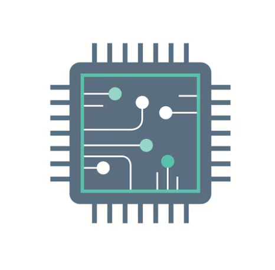

<h1 align="center">Hi, I'm Trinath Kella</h1>

  Passionate about VLSI Design & Verification

---

### Technical Skills

- **Programming Languages** – C, C++, Python, Shell Scripting  
- **HDLs** – Verilog, SystemVerilog  
- **Tools** – Vivado, Questa Sim, MATLAB, Xilinx SDK, TCL, Linux  
- **Methodology** – UVM (Universal Verification Methodology)
 

---

### Projects

- **Floating Point Unit using IEEE 754 (32-bit)**  
  Designed and implemented arithmetic operations (add, sub, mul, div) on Zynq-7000 using Vivado and Xilinx SDK.

---

### Find Me Online

  
  

---
