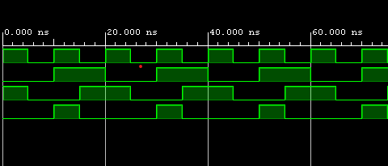

<h1 align="center">Hi, I'm Trinath Kella</h1>

  Passionate about VLSI Design & Verification

---
<table>
  <tr>
    <td valign="top" width="60%">

### Technical Skills

**Programming Languages** - C, C++, Python, Shell Scripting

**Hardware Description Languages** - Verilog, SystemVerilog

**Tools & Technologies** - Vivado, Questa Sim, MATLAB, Xilinx SDK, TCL, Linux

**Methodologies** - UVM (Universal Verification Methodology)

 </td>
   <td align="center" width="40%">
     
      
     <i>Digital · RTL · Verification</i>
   </td>
  </tr>
</table>

---

### Projects
- **Floating Point Unit using IEEE 754 (32-bit)**  
  Designed and implemented arithmetic operations (add, sub, mul, div) on Zynq-7000 using Vivado and Xilinx SDK.

---

### Find Me Online

  
  

---
